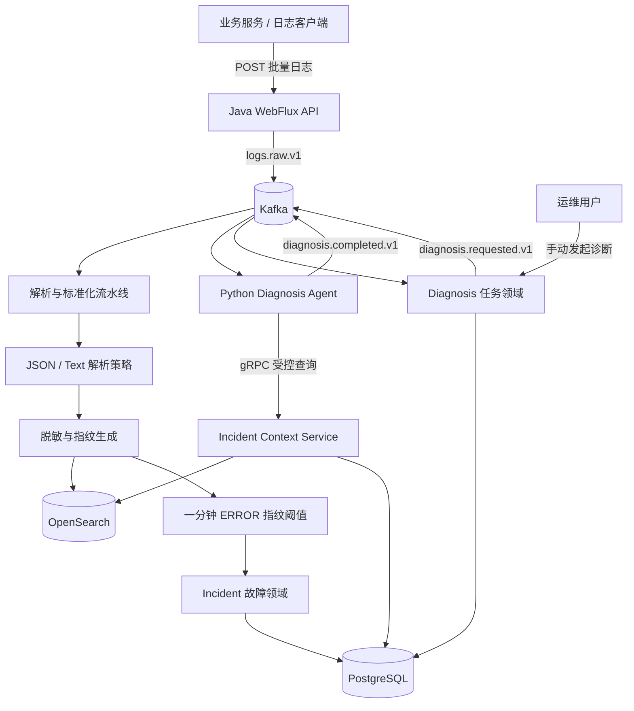
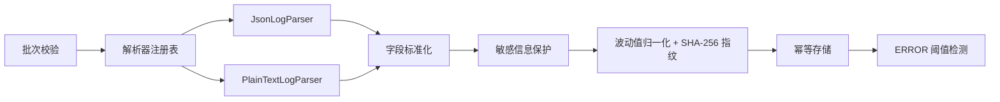

# Observability Platform

面向微服务系统的高并发日志平台与智能故障诊断系统。平台将日志接入、检索、故障发现和 AI 辅助诊断串成一条可审计的闭环，让研发与运维人员能够从“发生了什么”继续追踪到“为什么发生、证据是什么、下一步怎么处理”。

## 业务目标

生产系统的日志通常分散在多个服务与实例中。仅有日志搜索无法解决重复告警、故障归并和根因分析耗时过长的问题。本项目的目标是：

- 可靠接收 JSON 与文本日志，解析失败时仍保留经过安全保护的原始内容。
- 统一服务、环境、时间、级别、Trace ID 和扩展属性，支持条件与全文检索。
- 通过日志指纹聚合相似错误，使用确定性规则发现故障，避免把不稳定的模型推理放在实时接入链路中。
- 将故障上下文以受控工具提供给 Diagnosis Agent，输出根因、可信度、日志证据和处理建议。
- 保留诊断任务、报告版本与工具调用记录，使分析过程可追踪、可重放、可人工接管。
- Agent 不可用时，日志接入、查询和故障管理仍然正常运行。

当前 Java 平台完成第一阶段 MVP 的平台侧能力：打通“日志接入 → 查询 → 固定阈值故障 → 人工发起诊断 → 接收并保存 Agent 报告”的业务闭环。Python Agent 在独立仓库中建设；自动诊断、RAG、对话追问和受控处置属于后续迭代。

## 系统架构设计



### 职责边界

Java 平台采用单个 Spring Boot 工程，按业务领域分包，不拆 Maven 多模块：

- `logging`：日志接入、解析、标准化、脱敏、指纹、存储与查询。它不管理故障状态，也不调用模型。
- `incident`：阈值检测、重复故障合并和故障生命周期。MVP 使用同服务、同环境、同指纹一分钟内 3 条 ERROR 的固定规则。
- `diagnosis`：诊断任务、报告版本以及 Java 与 Agent 的协同。Python 不能直接修改 Java 故障状态或访问业务数据库。
- `configuration` / `support`：Kafka、gRPC、错误响应和跨领域技术支撑。

每个领域遵循 `interfaces → application → domain ← infrastructure` 的依赖方向：协议入口只负责转换，应用层编排用例，领域层保存业务规则，基础设施层实现 Kafka、OpenSearch 和 PostgreSQL 适配器。

### 通信与数据归属

| 数据或场景 | 组件 | 设计原因 |
| --- | --- | --- |
| 原始日志批次、诊断任务和诊断结果 | Kafka | 异步削峰、失败重试、消费者扩展和事件重放 |
| 原始/标准化日志、指纹及全文检索 | OpenSearch | 面向高吞吐日志的时间范围过滤与全文查询 |
| 故障、诊断任务和版本化报告 | PostgreSQL | 强一致业务状态、唯一约束和审计保留 |
| Agent 查询故障相关日志 | gRPC | 跨语言强类型接口；Agent 无数据库权限 |
| HTTP 接入与查询 | Spring WebFlux | 非阻塞请求处理和背压友好的 API |

Kafka 只承担传输职责，不作为永久查询数据库。OpenSearch 中使用确定性的日志 ID，PostgreSQL 使用故障去重键和任务版本唯一约束，共同抵抗重复投递。

### 日志处理流水线



解析采用策略与注册表模式；标准化、敏感信息保护和指纹生成组成可扩展流水线；Repository 隔离领域与存储；事件发布器和 gRPC 服务使用适配器模式。

## 已实现能力

- 批量接收最多 1000 条日志，支持 JSON、TEXT、AUTO 格式。
- JSON 字段别名解析、文本级别识别、解析失败回退与 `rawMessage` 保留。
- 手机号、密码、Token、Authorization 和 Cookie 脱敏。
- 对 UUID、IP 和数字等波动值归一化后生成稳定错误指纹。
- 按时间、服务、环境、级别、Trace ID、关键词和指纹查询。
- 同一分钟错误阈值检测及故障去重。
- 手动创建诊断任务，同一故障只允许一个活动任务，完成后递增报告版本。
- 提供 Kafka 诊断事件与 gRPC 受控上下文契约，供独立的 Python Agent 接入。
- Kafka/OpenSearch/PostgreSQL 外部适配器以及无需中间件的本地内存适配器。
- Java 端到端自动化测试和 k6 基础吞吐脚本。

## API

| 方法 | 路径 | 说明 |
| --- | --- | --- |
| `POST` | `/api/v1/logs/batch` | 批量接收日志 |
| `GET` | `/api/v1/logs` | 按条件查询日志，单次最多 200 条 |
| `GET` | `/api/v1/incidents` | 查询故障列表 |
| `GET` | `/api/v1/incidents/{incidentId}` | 查询故障详情 |
| `POST` | `/api/v1/incidents/{incidentId}/diagnoses` | 人工创建诊断任务 |
| `GET` | `/api/v1/diagnoses/{taskId}` | 查询任务状态和最新报告 |
| `GET` | `/actuator/health` | 服务健康检查 |

日志批次示例：

```bash
curl -X POST http://localhost:8080/api/v1/logs/batch \
  -H "Content-Type: application/json" \
  -d '{
    "batchId": "demo-001",
    "service": "orders-service",
    "environment": "local",
    "logs": [
      {
        "timestamp": "2026-09-16T10:00:00Z",
        "content": "{\"level\":\"ERROR\",\"message\":\"database connection timed out after 3000ms\",\"traceId\":\"trace-001\"}",
        "format": "JSON"
      }
    ]
  }'
```

## 运行方式

### 完整基础设施

需要 Docker Compose。该模式启动 PostgreSQL、Kafka、OpenSearch 和 Java 平台：

```bash
docker compose up --build
```

平台 HTTP 端口为 `8080`，Java gRPC 端口为 `9090`，OpenSearch 调试端口为 `9200`。Compose 使用 `ADAPTER_MODE=external`，首次启动会初始化 PostgreSQL 表并创建 Kafka 主题。宿主机上的独立 Agent 项目使用 `localhost:29092` 连接 Kafka、使用 `localhost:9090` 连接 Java gRPC；Compose 网络内部仍使用 `kafka:9092`。

### 无中间件本地模式

需要 JDK 17+ 和 Maven 3.6.3+：

```bash
mvn spring-boot:run -Dspring-boot.run.arguments="--app.grpc.enabled=false"
```

默认 `ADAPTER_MODE=local`，日志、故障和诊断任务保存在内存中，适合 API 调试和测试；进程退出后数据不会保留，也不会自动运行 Python Agent。

## 测试与压测

```bash
mvn test
k6 run load-test/log-ingestion.js
```

端到端测试覆盖 JSON/文本处理、解析失败保留、敏感信息保护、错误指纹聚合、故障生成、诊断任务、报告保存和报告版本递增。k6 默认向本机平台持续发送每批 100 条日志，验收阈值为失败率低于 1%、P95 小于 500ms；实际吞吐结论应在目标部署规格和完整外部基础设施上重新测量。

## 关键配置

| 环境变量 | 默认值 | 说明 |
| --- | --- | --- |
| `ADAPTER_MODE` | `local` | `local` 使用内存，`external` 使用 Kafka/OpenSearch/PostgreSQL |
| `MAX_BATCH_SIZE` | `1000` | 单批日志上限 |
| `ERROR_THRESHOLD` | `3` | 一分钟同指纹 ERROR 故障阈值 |
| `KAFKA_BOOTSTRAP_SERVERS` | `localhost:9092` | Kafka 地址 |
| `DATABASE_URL` | `r2dbc:postgresql://localhost:5432/observability` | PostgreSQL R2DBC 地址 |
| `OPENSEARCH_URL` | `http://localhost:9200` | OpenSearch 地址 |
| `GRPC_PORT` | `9090` | Java gRPC 服务端口 |

## MVP 边界与后续演进

本阶段故障检测采用固定 ERROR 数量阈值，Agent 使用可重复验证的启发式诊断逻辑。尚未实现 OpenTelemetry 原生接入、多行堆栈自动合并、可配置规则、自动诊断、RAG、对话追问、多租户权限、通知和自动处置。

后续按“可靠日志能力 → 可配置告警与自动诊断 → RAG 与对话 → 高并发生产化 → 审批式处置”演进。在任何阶段，高风险操作都只能形成待审批命令，Agent 不得绕过权限直接执行。
