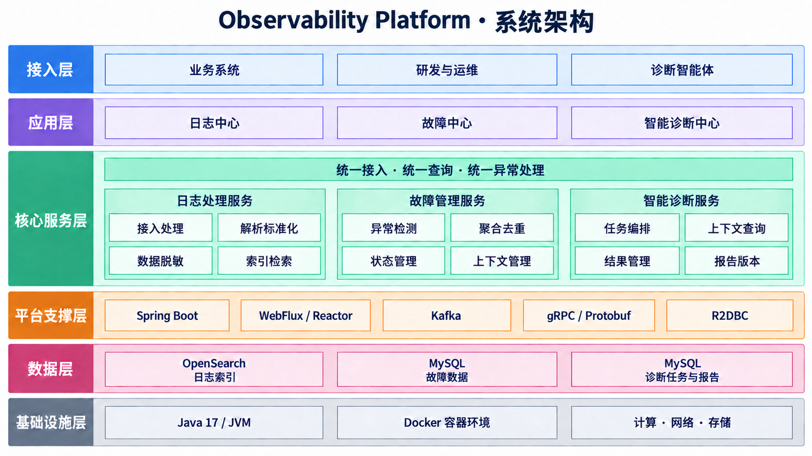

# Observability Platform

面向微服务场景的日志观测与故障诊断平台。系统把分散的服务日志转化为可检索的调用链、可管理的故障以及可追踪的诊断任务。

## 系统架构



## 项目职责

### 核心业务上下文

| 模块 | 职责 |
| --- | --- |
| `logging` | 日志接入、解析、脱敏、指纹生成、索引与查询 |
| `incident` | 异常策略、请求指标统计、异常检测、故障去重、恢复与通知 |
| `diagnosis` | 诊断任务编排、Agent 协作与报告管理 |

#### Logging：日志上下文

`logging` 接收业务服务上报的批量日志，将不同格式解析为统一的 `LogEntry`，完成敏感信息脱敏、级别标准化和错误指纹生成。它负责日志、Trace 和 Request 查询，并向 Incident 提供错误与请求完成事实；不负责判断故障状态，也不保存诊断报告。

#### Incident：故障上下文

`incident` 把观测事实聚合成可管理的故障。它按接口、服务、全局的优先级选择策略，检测重复错误、请求量突增或骤降、无流量、错误码异常和失败率突增。同类异常跨窗口归并为同一个 Incident，连续健康后自动恢复，再次发生时重新打开。它同时维护负责人、状态、解决结论、代表 Trace、策略版本和通知结果。

#### Diagnosis：诊断上下文

`diagnosis` 围绕已有 Incident 创建诊断任务，管理任务版本和状态，向 Diagnosis Agent 发布请求，并校验 Agent 返回的根因、证据、建议和工具调用记录。它支持超时、取消和重试；不直接修改日志，也不负责决定是否创建故障。

### 平台治理职责

| 能力 | 职责 |
| --- | --- |
| 权限控制 | 对 REST API 执行身份认证，并区分只读、运维和管理员角色 |
| `audit` | 记录人工操作、业务结果、变更前后状态和权限拒绝 |
| 消息可靠性 | 对 Kafka 消费失败执行分类重试、死信保存、查询和人工重放 |
| `retention` | 按配置分批清理指标窗口、Trace 样本、终态通知、死信和审计记录 |

### 外部依赖职责

| 组件 | 在系统中的职责 |
| --- | --- |
| Kafka | 解耦日志处理和诊断协作，承载日志批次、诊断事件及失败消息 |
| Elasticsearch | 保存日志 Data Stream，提供按字段过滤和全文检索 |
| MySQL | 保存指标窗口、Incident、诊断、通知、死信、策略和审计记录 |
| Notification Webhook | 接收故障创建和恢复通知 |

## 职责关系

一次完整链路由三个业务上下文顺序协作：

1. 业务服务通过 HTTP 把日志交给 Logging；Logging 校验批次后将其发布到 Kafka，由日志消费者异步解析、脱敏、生成指纹并写入 Elasticsearch。
2. 日志成功写入后，Logging 将错误和请求完成事实交给 Incident；Incident 通过共享指标窗口检测异常，创建、更新或恢复故障并写入 MySQL。
3. 研发人员为 Incident 发起诊断；Diagnosis 创建任务并通过 Kafka 通知 Diagnosis Agent。
4. Diagnosis Agent 通过 gRPC Context Service 查询故障和相关日志，完成分析后通过 Kafka 返回结果。
5. Diagnosis 校验任务状态，保存报告并把任务标记为成功或失败。

业务关系可以概括为：`Logging` 提供观测事实，`Incident` 将事实聚合成故障，`Diagnosis` 围绕故障组织分析过程。三个上下文维护各自的领域模型，通过应用服务、查询接口和事件协作，不共享领域实体。

## 技术栈

| 类别 | 技术 |
| --- | --- |
| 应用框架 | Java 17、Spring Boot、Spring WebFlux |
| 消息系统 | Kafka |
| 日志检索 | Elasticsearch 9.5、Data Stream |
| 关系数据库 | MySQL、R2DBC、Flyway |
| 服务通信 | HTTP、gRPC、Protocol Buffers |
| 部署与测试 | Docker Compose、JUnit、Testcontainers、k6 |

## 快速开始

### 完整环境

安装 Docker 与 Docker Compose 后运行：

```bash
docker compose up --build
```

默认服务地址：

- HTTP API：`http://localhost:8080`
- 健康检查：`http://localhost:8080/actuator/health`
- Prometheus 指标：`http://localhost:8080/actuator/prometheus`
- gRPC：`localhost:9090`
- Kafka：`localhost:29092`
- Elasticsearch：`http://localhost:9200`
- MySQL：`localhost:3306`

Elasticsearch 使用 `logs-observability-default` Data Stream 保存日志。应用启动后会自动安装索引模板，配置字段映射和默认 30 天数据保留周期；可通过 `ELASTICSEARCH_DATA_STREAM` 与 `ELASTICSEARCH_RETENTION` 调整。

外部模式启动时由 Flyway 通过 JDBC 先执行数据库版本迁移，业务数据仍通过 R2DBC 读写。迁移脚本位于 `src/main/resources/db/migration`，后续数据库结构变更必须新增版本脚本，不能修改已经发布的迁移。

平台会定时分批清理过期指标窗口、Trace 样本、终态通知、死信和审计记录。指标保留期会自动覆盖已启用异常策略所需的最长同比周期；保留天数、批次大小和单轮批次上限可通过 `app.retention` 配置。

Prometheus 会采集 HTTP 请求数量、状态和耗时直方图。告警规则位于 `ops/prometheus/alerts.yml`，指标端点只允许管理员访问。

早期由 `schema.sql` 创建的数据库首次升级时，需要临时设置 `MIGRATION_BASELINE_ON_MIGRATE=true`；确认生成 `flyway_schema_history` 后应恢复为 `false`。全新数据库不需要开启该配置。

Docker Compose 为本地开发关闭了 Elasticsearch 身份认证。生产环境应启用认证与 TLS，并通过受控凭据访问集群。

停止服务：

```bash
docker compose down
```

### 本地内存模式

本地运行需要 JDK 17 和 Maven 3.6.3+：

```bash
mvn spring-boot:run -Dspring-boot.run.arguments="--app.grpc.enabled=false"
```

该模式不依赖外部中间件，进程退出后数据不会保留。

### 身份认证

除健康检查外，REST API 默认使用 HTTP Basic 认证。开发环境提供三个账号：`viewer/viewer-local`（只读）、`operator/operator-local`（日志接入和故障处理）、`admin/admin-local`（策略、审计和管理指标）。部署时必须通过 `SECURITY_*_USERNAME`、`SECURITY_*_PASSWORD` 环境变量替换默认凭据，并在 TLS 后使用。

## API

| 方法 | 路径 | 说明 |
| --- | --- | --- |
| `POST` | `/api/v1/logs/batch` | 批量接收日志 |
| `GET` | `/api/v1/logs` | 查询日志 |
| `GET` | `/api/v1/traces/{traceId}` | 查询日志并还原服务调用树 |
| `GET` | `/api/v1/requests/{requestId}/traces` | 通过请求标识查询调用链 |
| `GET` | `/api/v1/traces/{traceId}/incidents` | 查询调用链关联故障 |
| `GET` | `/api/v1/incidents` | 按状态、类型、服务、环境、负责人和时间分页查询故障 |
| `GET` | `/api/v1/incidents/{incidentId}` | 查询故障详情 |
| `GET` | `/api/v1/incidents/{incidentId}/traces` | 查询故障关联调用链 |
| `GET` | `/api/v1/incidents/{incidentId}/notifications` | 查询故障通知结果 |
| `PATCH` | `/api/v1/incidents/{incidentId}/assignee` | 分派故障 |
| `PATCH` | `/api/v1/incidents/{incidentId}/status` | 流转状态并填写解决结论 |
| `POST` | `/api/v1/incidents/{incidentId}/diagnoses` | 创建诊断任务 |
| `GET` | `/api/v1/incidents/{incidentId}/diagnoses` | 查询故障的历次诊断任务与失败原因 |
| `GET` | `/api/v1/diagnoses/{taskId}` | 查询诊断任务与报告 |
| `POST` | `/api/v1/diagnoses/{taskId}/cancel` | 取消诊断任务 |
| `POST` | `/api/v1/diagnoses/{taskId}/retry` | 创建下一版本诊断任务 |
| `GET` | `/api/v1/dead-letters` | 按主题、状态、错误类型和时间分页查询死信 |
| `POST` | `/api/v1/dead-letters/{id}/replay` | 重放死信消息 |
| `GET` | `/api/v1/dead-letters/{id}/replay-attempts` | 查询历次重放结果与失败原因 |
| `GET` | `/api/v1/anomaly-policies` | 查询异常策略 |
| `GET` | `/api/v1/anomaly-policies/{policyId}` | 查询异常策略详情 |
| `POST` | `/api/v1/anomaly-policies` | 创建服务或接口异常策略 |
| `PUT` | `/api/v1/anomaly-policies/{policyId}` | 按版本修改异常策略 |
| `GET` | `/api/v1/audit-records` | 按操作者、动作、对象、结果和时间分页查询审计记录 |
| `GET` | `/actuator/health` | 健康检查 |
| `GET` | `/actuator/prometheus` | Prometheus 指标 |

日志接入示例：

```bash
curl -u operator:operator-local -X POST http://localhost:8080/api/v1/logs/batch \
  -H "Content-Type: application/json" \
  -d '{
    "batchId": "demo-001",
    "service": "orders-service",
    "environment": "local",
    "logs": [
      {
        "timestamp": "2026-09-16T10:00:00Z",
        "content": "{\"level\":\"ERROR\",\"message\":\"database connection timed out\",\"traceId\":\"0af7651916cd43dd8448eb211c80319c\",\"spanId\":\"b7ad6b7169203331\",\"operation\":\"POST /orders\",\"statusCode\":500,\"success\":false,\"errorCode\":\"DATABASE_TIMEOUT\",\"durationMs\":1200}",
        "format": "JSON"
      }
    ]
  }'
```

链路中的服务共享同一个 `traceId`，每次服务调用使用独立 `spanId`，并通过 `parentSpanId` 记录上游调用。平台 API 会在响应头返回 `X-Trace-Id`；被观测服务也需要在入口生成或接收 Trace 上下文，并向下游透传。

### 错误响应

所有 API 错误都返回稳定错误码和 `retryable` 字段：

```json
{
  "code": "DEPENDENCY_TIMEOUT",
  "message": "A downstream dependency timed out",
  "retryable": true,
  "timestamp": "2026-09-19T10:00:00Z",
  "details": []
}
```

| 错误码 | HTTP 状态 | 可重试 | 含义 |
| --- | ---: | :---: | --- |
| `AUTHENTICATION_REQUIRED` | 401 | 否 | 未提供凭据或凭据无效 |
| `ACCESS_DENIED` | 403 | 否 | 当前角色无权执行该操作 |
| `INVALID_REQUEST` | 400 | 否 | 请求格式、字段校验或领域参数不合法 |
| `RESOURCE_NOT_FOUND` | 404 | 否 | 指定资源不存在 |
| `BUSINESS_CONFLICT` | 409 | 否 | 当前领域状态不允许执行该操作 |
| `DEPENDENCY_RATE_LIMITED` | 503 | 是 | 下游依赖触发限流 |
| `DEPENDENCY_TIMEOUT` | 504 | 是 | 下游依赖调用超时 |
| `DEPENDENCY_UNAVAILABLE` | 503 | 是 | MySQL、Kafka 或 Elasticsearch 等依赖暂时不可用 |
| `DEPENDENCY_REJECTED` | 502 | 否 | 下游明确拒绝请求，原请求不变时重试无效 |
| `INTERNAL_ERROR` | 500 | 否 | 未分类的内部错误，默认禁止自动重试以避免重试风暴 |

客户端只应对 `retryable=true` 且自身操作具备幂等性的请求执行有限次数重试，并使用指数退避和随机抖动；不可重试错误需要修改请求、业务状态或程序逻辑后再提交。

## 代码结构

```text
src/main/java/org/zmy/observabilityplatform
├─ logging
├─ incident
├─ diagnosis
├─ retention
├─ audit
├─ bootstrap
└─ shared

业务模块
├─ interfaces       HTTP、Kafka、gRPC 等协议入口
├─ application      用例编排、Command、Query 和 DTO
├─ domain           领域模型、领域服务、事件和 Repository 接口
└─ infrastructure   数据库、消息和其他技术实现
```

## 测试

```bash
mvn test
mvn verify -Pintegration-tests
k6 run load-test/log-ingestion.js
```

`mvn test` 只运行快速单元测试；`integration-tests` Profile 使用 Testcontainers 启动 MySQL、Kafka 和 Elasticsearch，需要本机提供 Docker 环境。
